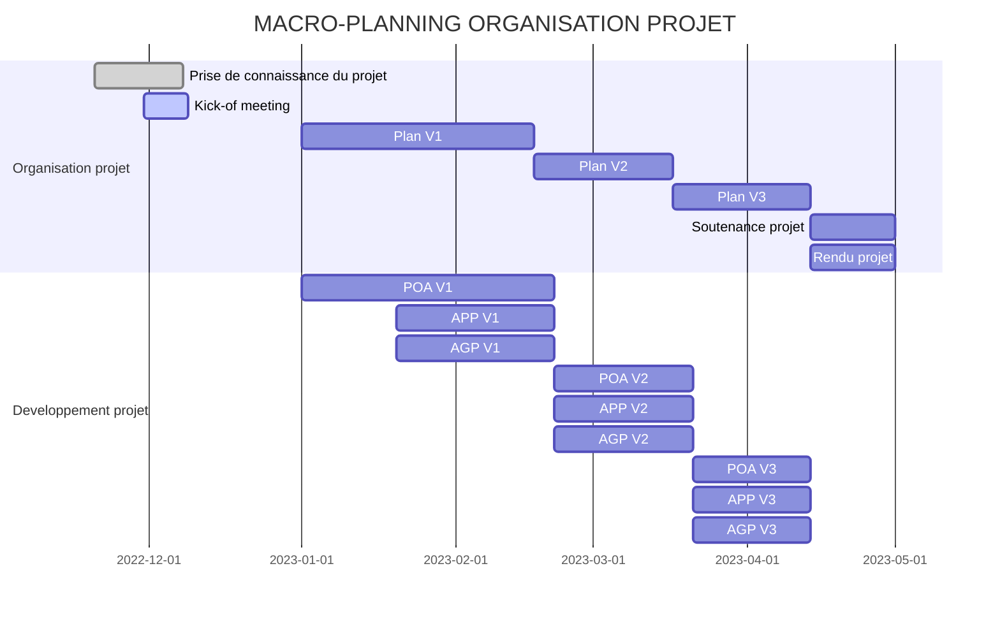

# TER : Implémentation d'algorithmes de jointure et évaluation leurs performances

## Table des matières

* [Parties prenantes](#chapter1)

* [Description et objectifs du projet](#chapter2)

* [Organisation du projet](#chapter3)

* Communications

* Livrables

* Macro-planning

* [Développement du projet](#chapter4)

* Outils de développement

* Processus du projet

  
  

## Parties prenantes 

  

**-Encadrante :** Mme. Shaoyi YIN (IRIT-Equipe Pyramide)  shaoyi.yin@irit.fr

**-Equipe :** Morgan Lantrade et Enguerran Couderc-Lafont (M1 IAFA)
  
  

## Description et objectifs du TER 

#### Contexte général

  

  

### Communication
**Client-Fournisseur :**
- Discord : Pour les questions, retours et prise de décisions
- Github : Pour le suivi du projet, et les livrables
- Physique : Lors des réunions
- Mail : Communication formelle

**Equipe:**
- Discord (un serveur propre à l"équipe)
- Physique 
  

### Livrables du projet
|**Livrables organisation projet**|**Livrables développement projet**|
|--------|--------|
|   Présentation Kick-off meeting + Compte rendu (13 Janvier)   |   Processus outillé de génération de modèle de performance (**POA**)    |
|  Plan V1 (17 Février) | Application de génération de polaire (**AGP**)|
|Plan V2 (17 Mars) |    Application de prédiction de performance (**APP**)    |
|Plan V3 (14 Avril)   |
|Soutenance ( Avril) | |
|Rendu projet (Avril) |

  

### Macro-planning organisation projet :

  
  

- Livrables V1 : Version basique en jupyter notebook et scripts python, sans interface APP/AGP

- Livrables V2 : Version intermédiaire avec interface basique

- Livrables V3 : Version avancée avec interface fonctionnelle

  
  

## Développement du projet 

Nous mettrons en priorité la réalisation d'un modèle de performance basique (sans apprentissage) pour pouvoir débuter en parallèle les applications de génération de polaires et de prédictions.

### Processus outillé de génération de modèle de performance (POA)

Responsable: Morgan Lantrade

  

##### Activités principales:

- [ ] Conversion d'enregistrements NMEA en fichier csv avec caractérisation.

- [ ] Création d'un modèle de performance basique .

- [ ] Création visuel (dynamique?) pour analyse des données.

- [ ] Création d'un modèle de performance par apprentissage.

  

##### Contraintes:

- Pouvoir choisir/ajouter un langage de l'interface : Français, Anglais,..

- Windows, Linux 64 bits et logiciels open source.

- Visualiser les paramètres d'entrées disponibles et pouvoir indiquer ceux qui sont exploités ( voir L0 Backlog).

### Application de génération de polaire (AGP)

Responsable: Justin Appel

  

##### Activités principales:

- [ ] Création d'un fichier polaire à partir d'un modèle de performance (.pol).

- [ ] Création d'un outil d'analyse de polaire.

  

##### Activités secondaires:

- [ ] Création d'une interface.

  

##### Contraintes:

- Pouvoir choisir/ajouter un langage de l'interface : Français, Anglais,..

- Windows, Linux 64 bits et logiciels open source

- Fonction python

  

### Application de prédiction de performance (APP)

Responsable: Enguerran Couderc-Lafont

  

##### Activités principales:

- [ ] Création d'un prédicteur de performance.

- [ ] Création d'un outil d'analyse de performances.

  

##### Activités secondaires:

- [ ] Création d'une interface

##### Contraintes:

- Pouvoir choisir/ajouter un langage de l'interface : Français, Anglais,..

- Windows, Linux 64 bits et logiciels open source

- Fonction C ou C#

  

#### Outils de développement
| |**Processus outillé de génération de modèle de performance (POA)**|**Application de  génération de polaire  (AGP)**|**Application de prédiction de performance (APP)**|
|:--------:|:-----------|:-------------|:-----------|
|  **Langage**  | Python    |Python|C# ou Java|
|  **Environnement**  |Windows et Linux 64 bits   |Windows et Linux 64 bits |Windows et Linux 64 bits|
|  **Fichiers**  |   readme,config    |readme,config |readme,config |

  

##### Choix technologiques

Pour débuter nous commencerons le projet avec l'outil **Jupyter Notebook**, qui permet de suivre de façon intéractive l'enchainement des taches.

  

Nous déciderons (avec l'accord du client) ensuite, du choix d'outil/framework qui semble le plus adapté.

  

##### Bibliothèques

- sklearn, scikit learn

- seaborn

- matplotlib

- pandas

- numpy

- ipywidgets

- joblib

### Processus du projet

  

### Macro-planning développement projet :

Les diagrammes de Gantt détaillés sont disponibles dans la cartouche  [planning](https://docs.google.com/spreadsheets/d/1CoWIv4PxDS0O70DAP6wnQrpyfxntgcEGLMPoNoksjwU/edit?usp=sharing) du document de suivi de projet. 
